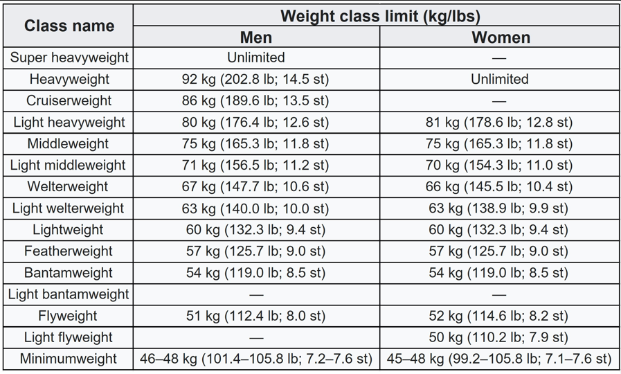
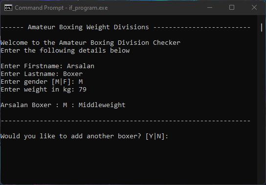
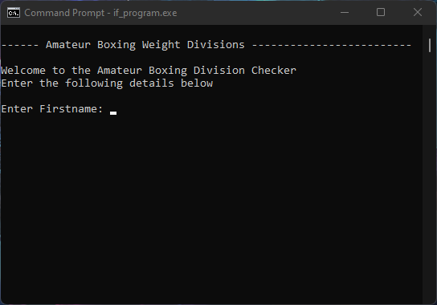
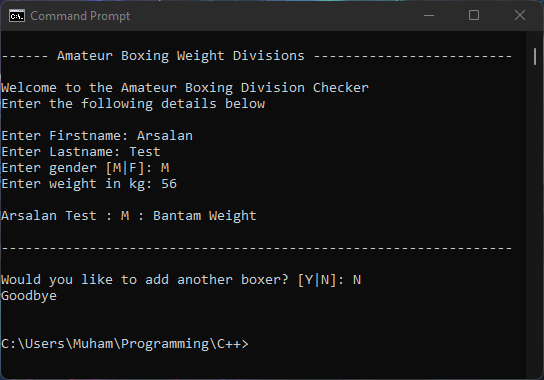

# Amateur_Boxing_Division_Table_cpp

You can use this program to find out what weight class you are in, the classes in this program are only for Amateur boxers.

## Table

Click on this link for more details --->
https://en.wikipedia.org/wiki/Weight_class_(boxing)

-----

## Screenshots of the program

^ Screenshot above shows my name, my gender and my weight class.

^ Screenshot above shows the program restarting after entering "y" string to run the program again.

^ Screenshot above shows the program ending afer entering "n" string.
